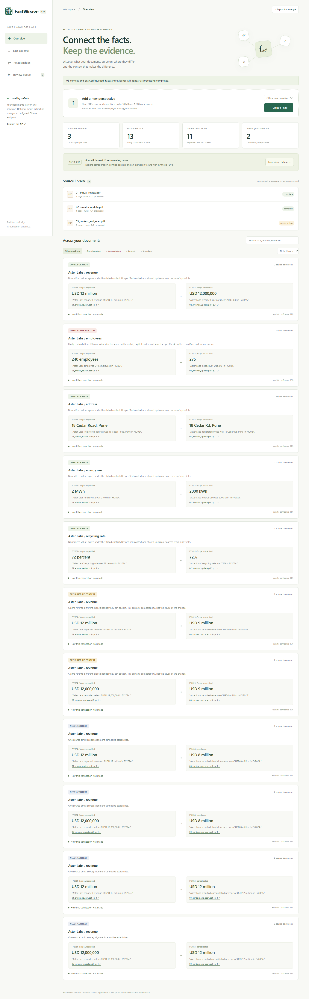
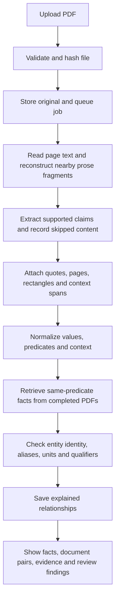

# FactWeave

**Connect the facts. Keep the evidence.** A local fact knowledge layer for PDF uploads, grounded numerical and semantic claims, and explained corroboration, likely contradictions, contextual reconciliation and uncertainty.



FactWeave turns supported statements in uploaded PDFs into inspectable claims, then compares related claims across documents. It is an engineering-assignment prototype: the default mode runs locally without a paid LLM, and every result keeps source evidence. It does not independently verify whether a document tells the truth.

## Contents

- [Setup and Run Instructions](#setup-and-run-instructions)
- [Using the interface](#using-the-interface)
- [Change the uploaded PDFs](#change-the-uploaded-pdfs)
- [Inspect connections from new PDFs](#inspect-connections-from-new-pdfs)
- [API](#api)
- [Configuration and saved data](#configuration-and-saved-data)
- [Troubleshooting](#troubleshooting)
- [Optional local model](#optional-local-model)
- [Tests and demo reproduction](#tests-and-demo-reproduction)
- [Video Demo](#video-demo)
- [Approach](#approach)
- [Repository guide](#repository-guide)
- [Limitations and Next Steps](#limitations-and-next-steps)
- [Additional Notes](#additional-notes)

## Setup and Run Instructions

Requires **Python 3.12+**. Offline mode needs no API key, paid account or database service.

### Get the repository

Install Python and Git, then run:

```bash
git clone https://github.com/ansharyan007/factweave.git
cd factweave
```

Alternatively, download the repository ZIP from GitHub, extract it, and open a terminal in the extracted folder containing `requirements.txt`. Run all commands below from that folder. There is no Node.js build step, Docker requirement, or separate database installation. Internet access is needed to install dependencies; default extraction then runs locally.

### Windows PowerShell

```powershell
python -m venv .venv
.venv\Scripts\python -m pip install -r requirements.txt
.venv\Scripts\python -m uvicorn app.main:app --host 127.0.0.1 --port 8000
```

Or use `powershell -ExecutionPolicy Bypass -File start.ps1`.

### macOS / Linux

```bash
python3 -m venv .venv
source .venv/bin/activate
pip install -r requirements.txt
python -m uvicorn app.main:app --host 127.0.0.1 --port 8000
```

Open **http://127.0.0.1:8000**. Upload PDFs or click **Load demo dataset**. Processing updates automatically. Explore facts, filter relationships, expand reasoning, and click source links to inspect highlighted PDF evidence. Review failed or ambiguous extraction in the Review queue. Export all results as JSON.

Run **one server process / one Uvicorn worker**. Original uploads and SQLite are stored in gitignored `data/`. Set `FACTWEAVE_DATA_DIR` to isolate another knowledge layer. Limits: 30 MB and 1,000 pages per PDF. Scans are flagged, not OCR-processed.

### Stop, restart, and update

Keep the server terminal open while using the website. `localhost` is your computer, not a permanently hosted website. Closing the terminal, stopping Python, or restarting your computer can stop the server. Press **Ctrl+C** in the server terminal to stop it intentionally.

For subsequent Windows sessions, run this from the repository folder; dependency installation is unnecessary unless dependencies changed:

```powershell
.venv\Scripts\python -m uvicorn app.main:app --host 127.0.0.1 --port 8000
```

On macOS/Linux, activate `.venv` again and run the equivalent `python -m uvicorn ...` command above. Saved uploads survive a restart. Interrupted jobs are marked failed and can be retried in the interface.

To install a project update, stop the server, run `git pull`, reinstall `requirements.txt` using the virtual-environment Python, and start the server again. Use **Reprocess** on existing PDFs when you want results from an updated extractor; a browser refresh alone does not rebuild stored facts.

## Using the interface

For a first evaluation, start with an empty collection and click **Load demo dataset**. The three synthetic PDFs demonstrate the required cases and produce **13 facts**. A fresh clone starts with an empty uploaded library; files in `samples/` are available to load but are not automatically ingested. The original assignment PDFs in `starter-datasets/` are not included in the GitHub checkout.

For your own documents:

1. Select **Offline · conservative**, then click **Upload PDFs** or drag files into the upload panel. You may select multiple PDFs. Each receives a separate processing job.
2. Watch the Source library in **Overview**. Processing runs sequentially in the background, and the browser polls for updates. Final facts and relationships become visible when each document finishes.
3. Open **Fact explorer** to inspect individual claims. A fact can exist without a relationship to another PDF.
4. Open **Relationships**, or select a pair under **Connected documents**. Filter by relationship type, predicate, or search text. Select **Show all document pairs** to remove a pair filter.
5. Expand **How this connection was made** for comparison steps. Click a source filename/page button to open the evidence inspector and original PDF.
6. Check **Review queue** for missed or ambiguous content. Use **Export knowledge** to download the collection as JSON.

| Interface area | What it means |
| --- | --- |
| Overview / Source library | Uploaded files, extraction mode, page progress, status, fact/connection counts and document controls |
| Fact explorer | Extracted subject, metric, value, time/scope, qualifiers and source evidence |
| Connected documents | PDF pairs with at least one relationship; counts distinguish agreement, context and uncertainty |
| Relationships | Side-by-side claims with an explanation; a connection is not necessarily agreement |
| Review queue | Source statements/pages that the extractor could not safely interpret; findings are not factual claims |
| Evidence inspector | Quote, normalized value, page image, enclosing rectangle and separate context spans where used |
| Export knowledge | Full JSON snapshot, including documents, facts, relationships, issues, predicates and pair summaries |

### Understand processing status

| Status | Meaning / next action |
| --- | --- |
| `queued` | Waiting for the single worker; no action needed |
| `processing` | Extracting pages; wait for completion |
| `complete` | Processing finished without recorded extraction findings; this does not guarantee full coverage |
| `needs_review` | Processing finished with findings. Facts and connections can still be available; inspect Review queue |
| `failed` | A processing job failed or was interrupted. Inspect its error, then Retry or Replace |

### Understand connection types

| UI label / JSON kind | Meaning |
| --- | --- |
| Corroboration / `corroborates` | Normalized claims agree under the context the system could align |
| Likely contradiction / `contradicts` | Values differ for an aligned entity/metric and explicit period; omitted definitions may still explain the difference |
| Explained by context / `reconciled` | Period, scope, units/displayed precision, or explicit reporting windows explain why figures need not be identical |
| Needs context / `uncertain` | A possible connection exists, but missing identity, dates, units, bounds or qualifiers prevent a stronger conclusion |

Confidence percentages are heuristic indicators, not measured probabilities. Multiple documents can repeat the same upstream source; corroboration does not establish source independence. No source is automatically chosen as the truth.

### Change the uploaded PDFs

In **Overview → Source library**, each completed or failed PDF has **Replace** and **Delete** controls. **Clear collection** below the library starts an empty knowledge layer. Each action asks for confirmation.

- **Reprocess:** rerun the saved PDF with the current code and selected extraction mode, preserving its file and document ID. Previous derived results are removed and rebuilt, including cross-document links. Use this after upgrading the extractor; uploading identical bytes alone is deduplicated. The source library shows each PDF's fact count.
- **Replace:** select an updated PDF. The app validates it, removes the old upload and its facts, evidence, review findings and links, then extracts the replacement and compares it with the remaining documents. Other documents and their links remain intact. Replacement uses the extraction mode selected above the upload button and receives a new document ID.
- **Delete:** removes one uploaded PDF and all dependent knowledge. You can upload it again later.
- **Clear collection:** removes all uploaded PDFs and associated knowledge. Original files in `samples/` and `starter-datasets/` remain untouched. Upload custom PDFs or reload the demo afterwards.

Wait for the affected PDF to finish processing before replacing or deleting it; clearing requires all jobs to finish. Active jobs return HTTP 409. Invalid replacements and replacements that duplicate a different document preserve the original. Identical contents with the same extraction mode are a no-op, except failed jobs may be reprocessed. Accepted replacements may still encounter extraction errors, visible in their status/review findings.

File removal and database changes are coordinated: failed changes restore staged files, and startup recovery handles interrupted removals. If the operating system temporarily prevents cleanup of a staged file, it remains inaccessible through the API and cleanup retries at startup.

To reproduce the browser checks using an isolated temporary collection, install Playwright as below and run `python scripts/check_collection_ui.py`. The original demo video predates these management controls; [this screenshot](docs/collection-management.png) shows the new controls.

### Inspect connections from new PDFs

Every upload is compared with the completed documents already in the collection. **Connected documents** in Overview and Relationships lists each matched PDF pair with counts by relationship type. Select a pair to inspect both quotations, source pages and reasoning. Uploading resets stale search/pair filters so the new results are discoverable.

Source-library rows show fact and connection counts and explain whether a PDF is still processing, yielded no supported claims, or has no comparable claims in another document. Use **Reprocess** to upgrade existing results after a parser change. It preserves the original PDF and document ID.

The contextual prose extractor handles company references, document-grounded short names, financial/date wording, headcount, approximate customer/employee counts, founding years, and CEO appointment/resignation claims. It preserves interim status and qualifications. An unnamed organization stays unresolved; a matching metric/value is only a *possible* connection. `Rs.` is an unspecified rupee currency, not automatically INR. Separately quoted reporting-period definitions explain why financial-year and calendar-year totals need not agree.

Additional-upload validation: five one-page business documents previously produced zero facts. The revised run produced **21 facts and 16 connections across 8 PDF pairs**: 2 corroborations, 3 contextual reconciliations and 11 uncertain links. Automated tests also upload renamed, different-company fixtures in both orders and verify preservation of existing facts, evidence grounding and removal of stale pairs.

The app accepts arbitrary PDF filenames and contents, but it cannot promise a meaningful connection for every pair of PDFs. Unrelated material, scans without OCR, and unsupported grammar may yield none. It reports these limitations instead of inventing links.

### API

Interactive API docs: **http://127.0.0.1:8000/docs**.

```bash
curl -F "file=@your-document.pdf" -F "mode=rules" http://127.0.0.1:8000/api/documents
curl http://127.0.0.1:8000/api/documents
curl http://127.0.0.1:8000/api/knowledge
curl -o knowledge.json http://127.0.0.1:8000/api/export
```

On PowerShell use `curl.exe`. Upload returns HTTP 202 and an ID. Poll the document endpoint until `complete`, `needs_review` or `failed`.

| Endpoint | Purpose |
| --- | --- |
| `GET /api/health` | Check that the server is responding |
| `POST /api/documents` | Upload arbitrary PDFs; content-hash deduplication |
| `PUT /api/documents/{id}` | Replace using multipart `file` and optional `mode`; rebuild facts and links |
| `DELETE /api/documents/{id}` | Remove one PDF and all dependent knowledge |
| `POST /api/collection/reset` | Clear uploads and knowledge; requires JSON `{"confirm": true}` |
| `GET /api/documents` | Job status and page progress |
| `GET /api/documents/{id}` | Status of one upload |
| `GET /api/knowledge` | Facts, evidence, predicates, relationships and issues |
| `GET /api/documents/{id}/pdf` | Original PDF |
| `GET /api/documents/{id}/pages/{page}` | Extracted page text and dimensions |
| `GET /api/documents/{id}/pages/{page}/image` | Rendered source page |
| `POST /api/documents/{id}/reprocess?mode=rules` | Rebuild results for a saved, idle PDF; optionally use `mode=ollama` |
| `POST /api/documents/{id}/retry` | Retry failed/interrupted processing |
| `POST /api/demo` | Process bundled synthetic examples |
| `GET /api/export` | Download full JSON output |

### API workflow example

Use the document `id` returned by an upload in place of `DOCUMENT_ID`. These commands use `curl` syntax for macOS/Linux; PowerShell users can use `curl.exe`, or the interactive `/docs` page to avoid shell-specific JSON quoting.

```bash
# Read one processing job and its extracted page text.
curl http://127.0.0.1:8000/api/documents/DOCUMENT_ID
curl http://127.0.0.1:8000/api/documents/DOCUMENT_ID/pages/1

# Re-extract the same saved PDF after updating the code.
curl -X POST 'http://127.0.0.1:8000/api/documents/DOCUMENT_ID/reprocess?mode=rules'

# Replace one saved PDF with a new file and rebuild its dependent knowledge.
curl -X PUT -F 'file=@updated.pdf' -F 'mode=rules' http://127.0.0.1:8000/api/documents/DOCUMENT_ID

# Remove one uploaded PDF and its derived knowledge.
curl -X DELETE http://127.0.0.1:8000/api/documents/DOCUMENT_ID
```

Unlike the UI, API delete/replace requests do not show a confirmation dialog. Collection reset requires `POST /api/collection/reset` with JSON `{"confirm": true}`. Identical upload bytes return `duplicate: true` instead of another job, even if the filename changed. Reprocess is the explicit way to rerun a saved PDF.

Common error responses: `400` invalid PDF signature; `404` unknown document/page; `409` active job, conflicting replacement or unavailable source; `413` file exceeds 30 MB; `422` unreadable/password-protected PDF, unsupported page count, or invalid request fields. A successful upload response means the job was accepted, not that useful facts were found.

## Configuration and saved data

| Setting | Default | Purpose |
| --- | --- | --- |
| `FACTWEAVE_DATA_DIR` | `data` relative to the working directory | Directory containing the SQLite database and uploaded PDFs |
| `OLLAMA_URL` | `http://127.0.0.1:11434` | Optional local model server |
| `OLLAMA_MODEL` | `qwen2.5:7b` | Optional model name |
| Uvicorn `--host` / `--port` | Commands use `127.0.0.1:8000` | Local web-server address; use one worker |

Set environment variables **before starting the server**. `.env.example` is a reference file; this application does not automatically load a `.env` file.

For an isolated evaluator collection on Windows:

```powershell
$env:FACTWEAVE_DATA_DIR = "data/evaluator"
.venv\Scripts\python -m uvicorn app.main:app --host 127.0.0.1 --port 8000
```

On macOS/Linux, use `export FACTWEAVE_DATA_DIR=data/evaluator` before the normal start command. Stop any existing server on that port first. To return to the original directory, remove the variable (`Remove-Item Env:FACTWEAVE_DATA_DIR` in PowerShell or `unset FACTWEAVE_DATA_DIR` in bash) and restart.

Uploaded files are stored under generated IDs, not their display filenames. `knowledge.sqlite3` contains the persistent knowledge layer; generated PDF copies provide the original evidence. Exported JSON is useful for inspecting results but is **not** a restore/import format. To back up or move the application state, stop the server and copy the entire configured data directory, including database files and PDFs; restore it with the server stopped. Git does not back up this directory.

## Troubleshooting

| Symptom | What to check |
| --- | --- |
| Localhost does not open / connection refused | Start the server from the repository directory, keep its terminal open, and visit `http://127.0.0.1:8000` using HTTP. Check `/api/health`. A GitHub push does not host the app |
| Port 8000 is already in use | Use the existing server if it is this app, or start with `--port 8001` and visit port 8001 instead |
| `No module named ...` | Install `requirements.txt` using the same virtual-environment Python used to start Uvicorn |
| Cannot import `app.main` | Change into the repository folder before starting Uvicorn |
| PDF processed but no facts | Processing recovered pages, but supported claims may not have been extracted. Inspect Review queue and source text; scans require OCR, which is not implemented |
| Facts exist but no connections | At least two documents need comparable claims. Clear filters, inspect pair diagnostics, and check subject/metric/context differences. Uploading unrelated PDFs does not require a relationship |
| New code has no effect on saved results | Restart the server and use Reprocess. Duplicate uploads retain their prior extraction |
| Facts appear but status is `needs_review` | Expected when some statements were extracted and others were skipped. Open the review findings |
| Ollama extraction fails | Check that Ollama is running and the configured model is installed, or Reprocess using offline mode. Live model quality has not been evaluated |
| Replace/Delete/Clear is disabled | Wait for the affected processing job(s) to finish |
| Interrupted processing after restart | The job is marked failed. Retry it; previously completed documents remain saved |
| UI looks outdated | Refresh the page; use Ctrl+F5 if static assets are cached |

### Optional local model

Install/start [Ollama](https://ollama.com/), run `ollama pull qwen2.5:7b`, and select **Local model · Ollama** before uploading. Optional shell variables: `OLLAMA_URL` (default `http://127.0.0.1:11434`) and `OLLAMA_MODEL` (default `qwen2.5:7b`). `.env.example` documents them; `.env` is not auto-loaded. A remote endpoint receives extracted text, so use a local endpoint for local-only processing.

The adapter is implemented and tested with mocked responses; a live model was not installed during development. Offline mode and committed sample outputs are sufficient to evaluate the project. Duplicates preserve their original extraction mode; use Reprocess to change it, or another data directory to retain results for comparison.

### Tests and demo reproduction

```bash
pip install -r requirements-dev.txt
python -m pytest -q
```

On Windows without environment activation, use `.venv\Scripts\python -m pip install -r requirements-dev.txt` and `.venv\Scripts\python -m pytest -q`. For scripts, use `.venv\Scripts\python scripts/SCRIPT_NAME.py`. The suite has 71 tests. The sample PDFs are committed; regenerate with `python scripts/create_samples.py`. To record the actual UI interactions and run browser checks:

```bash
pip install playwright
playwright install chromium ffmpeg
python scripts/check_collection_ui.py
python scripts/record_demo.py
```

The recorder uses installed Chrome on Windows when available, otherwise Playwright Chromium. It starts an isolated server on port 8011 and writes a captioned MP4, screenshots, verification report and sample JSON. It leaves your normal knowledge layer untouched. If the supplied Delhivery PDFs are present under starter-datasets/delhivery, the recording includes their real examples. Run python scripts/evaluate_datasets.py starter-datasets to reproduce both full dataset evaluations.

## Video Demo

[Watch/download the captioned demo (under 3 minutes)](docs/demo/factweave-demo.mp4). The video shows an actual PDF upload, incremental processing and all four required cases, including evidence and reasoning. It is committed with the project; no paid account is needed. If GitHub does not play it inline, click **View raw** or download it.

The video includes the four synthetic cases plus real Delhivery corroboration and rounding reconciliation. Also see [real-data evaluation](docs/REAL_DATA.md), [Four Cases](docs/FOUR_CASES.md) and [full sample output](docs/sample-output.json).

## Approach

### What happens after an upload



1. **Validate and deduplicate.** Check PDF signature, readability, encryption, size and page count. SHA-256 identifies repeated content regardless of filename.
2. **Extract text.** PyMuPDF reads text blocks and coordinates. Nearby fragments with compatible column geometry may be joined. Original fragments remain separate grounding spans.
3. **Extract claims.** Offline mode combines general explicit-claim grammar, a statistical vocabulary, contextual business prose, and geometric KPI/simple-table extraction. Predicates are stored dynamically rather than as fixed database columns. Local-model mode uses the optional Ollama adapter instead of the offline prose passes; it is not an automatic fallback.
4. **Retain context and evidence.** Keep subject, metric, raw value, period/scope, qualifiers, exact normalized quotation, page number and enclosing rectangle. Inferred organization/country or reporting-period context includes its own evidence span. Unnamed organizations remain unresolved.
5. **Normalize conservatively.** Use decimal arithmetic for quantities/scales, selected metric aliases and compatible unit conversions. No exchange rates are assumed. Bounds, estimates, missing units and ambiguous symbols remain visible.
6. **Compare incrementally.** Retrieve same-predicate candidates from other completed documents. Check exact entity identity or source-grounded aliases, then evaluate context and values. New PDFs do not rebuild the entire existing collection. Reprocessing removes and rebuilds only that document's derived results and affected links.
7. **Expose the result.** Persist claims, comparisons and review findings in SQLite. The browser polls snapshots and lets a reviewer inspect both source claims and the comparison trace.

### What is stored

| Record | Main contents |
| --- | --- |
| Document | ID, original display name, content hash, mode, status and page progress |
| Page | Extracted text, page number, width and height |
| Fact | Subject/key, predicate, raw and normalized value, context, quote, page/rectangle, method and heuristic confidence |
| Relationship | Two fact IDs, kind, reasoning steps, confidence and caveat |
| Issue | Source document/page, optional quote/rectangle, skipped-content category and explanation |

Evidence character offsets refer to whitespace-normalized block text, not PDF byte offsets. Rectangles surround source blocks rather than precisely highlighting every word. A quote appearing in the PDF proves its textual source, not that the parser understood it correctly.

- **Evidence first:** retain the source PDF, page, exact whitespace-normalized quote, character offsets and enclosing source-block coordinates.
- **Understandable extraction:** general English grammar and geometric KPI/simple-table extraction support explicit claims; predicates can arise from document text. Optional Ollama supports broader phrasing with strict substring grounding.
- **Statistical prose:** join nearby text fragments within a column; recognize common growth/inflation/trade measures and `per cent` wording. A dominant country can supply an explicitly labeled, separately grounded inferred subject. Estimates and forecasts remain qualified claims. No filenames select extraction rules.
- **Context before conflict:** normalize values and units, align explicit periods/scopes, and abstain when comparison is unsafe.
- **Explain each connection:** every relationship carries both source links and a decision trace. Agreement is not proof; confidence is heuristic.
- **Incremental storage:** SQLite retrieves indexed predicate candidates, then checks entity identity and document-grounded aliases. New uploads preserve existing facts. Content hashing prevents duplicate evidence inflation. Flexible payloads accept new fact types.
- **Visible failures:** scans, ambiguous statements, unsupported qualifiers and model errors enter a review queue.

Architecture: **FastAPI + PyMuPDF + SQLite + vanilla HTML/CSS/JavaScript**, with optional Ollama. A graph database is unnecessary for this prototype; the useful part is grounded extraction and explanation. See [engineering notes](docs/APPROACH.md) for architecture, trade-offs, actual bugs and references.

**AI tools used:** OpenAI Codex assisted with architecture, implementation, test design, debugging, documentation and the scripted demo. No paid LLM is used by the default runtime. Review and understand the implementation before presenting it.

## Repository guide

| Path | Responsibility |
| --- | --- |
| `app/main.py` | FastAPI routes, upload validation, application startup, PDF/page/export endpoints |
| `app/pipeline.py` | Single-worker processing, page persistence and incremental comparison |
| `app/extraction.py` | General grammar, value normalization and optional Ollama adapter |
| `app/statistics.py` | Column-fragment reconstruction, statistical prose and inferred country context |
| `app/contextual.py` | Organization context, source-grounded aliases, business claims, date definitions and leadership events |
| `app/layout.py` | Geometric KPI cards and conservative simple-table extraction |
| `app/comparison.py` | Entity checks and explained corroboration/contradiction/reconciliation/uncertainty decisions |
| `app/store.py` | SQLite schema, connections, snapshots and document-pair summaries |
| `app/collection.py` | Coordinated document-file/database removal and recovery |
| `static/index.html`, `static/app.js`, `static/style.css` | Browser interface, polling, filters, collection controls and evidence viewer |
| `samples/` | Three committed synthetic demonstration PDFs |
| `scripts/create_samples.py` | Regenerate synthetic PDFs |
| `scripts/evaluate_datasets.py` | Process supplied local dataset folders in isolated databases and check grounding |
| `scripts/check_collection_ui.py` | Browser checks for document management and connection navigation |
| `scripts/record_demo.py` | Record the captioned demo using an isolated app instance |
| `tests/` | API, reasoning, layout, statistics and contextual-extraction regression tests |
| `docs/` | Approach, four cases, evaluation outputs, screenshots and demo video |
| `requirements.txt`, `requirements-dev.txt` | Pinned runtime and development dependencies |
| `start.ps1` | Windows helper that installs dependencies and starts Uvicorn in the foreground |
| `.github/workflows/tests.yml` | Automated test workflow |
| `.env.example`, `.gitignore` | Configuration reference and local-data exclusions |

To extend the prototype, start with a missed source sentence and a regression test, then update the relevant extractor. Preserve its quote/context spans and review comparison behavior before increasing coverage. Changes to metric aliases or entity matching can affect many links, so test both matches and cases that must remain separate.

## Limitations and Next Steps

- **Real-data coverage is uneven.** Both supplied datasets were evaluated: 212 claims from 227 Delhivery pages and 31 claims with 30 uncertain links from 284 macroeconomic pages. The macroeconomic baseline was five claims (zero from RBI); prose reconstruction and statistical extraction improve coverage but leave many statements unsupported. These are extraction counts, not accuracy scores. See [real-data evaluation](docs/REAL_DATA.md).
- The statistical supplement uses an expandable metric vocabulary; it is not a general language understanding model. Country inheritance is heuristic and can be wrong for implicit subpopulations or comparisons. Bare inflation subtypes remain unresolved. Offline grammar has limited English coverage. Complex tables, indirect claims, cross-sentence references and unfamiliar units can be missed or flagged.
- Scans need OCR. Next: OCR with numerical confidence review, layout reconstruction and table/header/footnote alignment.
- Semantic matching uses conservative aliases and normalization. Broader paraphrases and entity aliases need resolution and entailment checks; different text values usually remain uncertain.
- Layout facts retain separate metric/value/period/subject spans. Company ownership is inferred from document evidence and can be wrong on partner/case-study pages. Table-wide units and footnotes remain unresolved and force uncertain comparisons.
- Period parsing is coarse. Exact dates, fiscal calendars, overlapping intervals and implicit scope need richer context handling. Omitted scope weakens likely contradictions.
- Exact source substrings prove lexical grounding, not truth or complete entailment. Live model quality and real-document precision/recall are unmeasured; supplied-dataset coverage and source-span checks are reported.
- Single-worker processing, full snapshot responses and dense candidate buckets limit scale. Add durable workers, pagination, retrieval ranking, resource isolation and benchmarks.
- This is a local prototype, without authentication or multi-user isolation. Public hosting needs additional engineering.

## Additional Notes

| Required case | Included example |
| --- | --- |
| Corroboration | Revenue USD 12 million ↔ sales USD 12,000,000, FY2024 |
| Likely contradiction | 240 employees ↔ headcount 275, FY2024 |
| Contextual reconciliation | Revenue USD 12 million in FY2024 ↔ USD 9 million in FY2023 |
| Extraction failure | Scanned operating-profit claim is missed, its page is exposed in the review queue, and no fact is invented |

Bonus examples: address abbreviations, percentages, energy unit conversion, scope differences and missing-context uncertainty. All companies and figures in `samples/` are fictional. Extraction and comparison modules do not depend on sample values or filenames; only the demo loader locates the sample directory.

Credentials, uploaded PDFs, local data and the virtual environment are gitignored. Only synthetic PDFs, results and demo artifacts are committed. GitHub Actions runs the test suite on pushes and pull requests.

Before submitting, review the code, review the real-data evaluation, and provide the repository and video links through the assignment form. The form is not submitted automatically.
