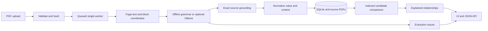

# Engineering notes

## Architecture

The knowledge layer stores **documented claims**, not certified truth. Raw evidence remains separate from its normalized interpretation.

## Extraction and evidence

PyMuPDF supplies page text blocks and geometry. Whitespace-normalized quotations retain character offsets within their source block, page number, enclosing rectangle and original document ID. The original PDF is preserved. The UI renders the actual page and marks the enclosing block, not an exact word highlight.

Offline extraction uses document-independent English grammar: possessive assertions, reporting statements, employment counts and locations. Predicates can come directly from text. A small global vocabulary connects sales/revenue and headcount/employees. There are no company, filename or document-specific extraction rules. This is a constrained parser, not a universal language model.

The optional Ollama adapter requests atomic assertions with dynamic predicates. JSON and exact substrings are checked for subject, predicate, value and quote; unsupported qualifiers and ambiguous context are rejected. Model errors enter the review queue without silent fallback. Lexical grounding does not prove semantic entailment or complete prompt-injection resistance. A live model was unavailable during implementation; adapter tests use mocked responses.

## Normalization and decisions

Decimal arithmetic normalizes magnitudes and compatible physical units. Currency conversion is not attempted, and a bare dollar symbol does not imply USD. Addresses receive case/punctuation normalization and a short abbreviation map, not geocoding. Legal suffixes are retained to avoid merging distinct companies.

Context uses explicit fiscal/calendar/quarter labels and a limited scope vocabulary. Four-digit quantities need temporal grammar to count as dates. The prose parser does not inherit headers, footnotes, pronouns or document scope. The layout extractor can inherit an explicit fiscal heading and a legal-name anchor, retaining each as a separate evidence span. Footnotes and table-wide units remain unresolved and force uncertain comparisons.

Comparison order:

1. Match conservative entity key and canonical predicate across different documents.
2. Mark incompatible types, units or currencies uncertain.
3. Inspect explicit period and scope, including missing alignment.
4. Different explicit contexts can reconcile the claims; this is not an explanation of the business change.
5. Equal normalized values with aligned stated context corroborate each other. Neither truth nor source independence is established.
6. Unequal numeric values in an explicit aligned period become a likely contradiction. Unspecified scope remains a caveat.
7. Different arbitrary text values remain uncertain because predicates may not be exclusive. Dated address mismatches may be likely contradictions, with multiple-address and normalization caveats.

Confidence scores are heuristic labels, not calibrated probabilities. No fact wins by majority vote.

## Storage and scaling

SQLite tables hold documents, pages, facts, relationships and issues. Flexible JSON payloads support new predicates without schema migrations. An indexed predicate column retrieves candidates across completed documents. Entity checks then admit exact names or source-grounded aliases while retaining distinctions between conflicting legal forms. Unnamed organizations can yield only uncertain same-metric/same-value candidate links. UUID filenames separate storage paths from display names. SHA-256 deduplication uses a write transaction, including concurrent uploads.

One worker processes PDFs page by page, commits progress, and only compares new facts with matching completed stored facts. Existing fact IDs remain stable across new uploads. Partial/failed jobs are hidden from the knowledge snapshot. Interrupted jobs become visibly failed at startup and can be retried. Run only one Uvicorn process.

Indexed blocking avoids a global all-pairs rebuild, but a dense bucket can still generate quadratic edges. The full snapshot and frontend search load all results. Large-scale throughput is unbenchmarked. Uploads are bounded at 30 MB / 1,000 pages and block extraction at 16,000 characters. Page rendering is on demand. Durable workers, pagination, retrieval-based matching and benchmarks are future work.

## Actual failures discovered

- **2000 kWh was mistaken for a year.** The date parser now requires temporal grammar around a bare year. Regression tested.
- **Plural possessives were missed.** The parser now accepts both “Lab's” and “Labs'”. Regression tested.
- **Image-only content is missed.** The review queue exposes the scanned source and withholds invented facts. OCR remains unimplemented.
- **Multiple years/values need alignment.** The “respectively” example is withheld with evidence. Structured multi-clause and table interpretation is a next step.

## Validation and references

Tests cover unseen entities/predicates, normalization, ambiguity, evidence offsets, all four cases, malformed/encrypted uploads, concurrency, deduplication, retry recovery and model grounding rejection. The browser script checks actual uploads, source dialogs, expanded reasoning, filters, search, duplicate loading and mobile overflow; its report is in `docs/demo/verification.json`.

Primary references: [FastAPI uploads](https://fastapi.tiangolo.com/tutorial/request-files/), [PyMuPDF tutorial](https://pymupdf.readthedocs.io/en/latest/tutorial.html), [Ollama generate API](https://docs.ollama.com/api/generate).

## Layout extension and real evaluation

A document-independent geometric extractor pairs prominent values with nearby aligned metric labels and handles simple rows whose every numeric cell aligns uniquely with an explicit period header. Partial/grouped header mappings and repeated subrow labels are rejected. Separate evidence spans retain inferred document subject, metric, value and period. Layout ownership remains heuristic. Displayed precision can reconcile scaled figures whose rounding intervals overlap. See [Real Data](REAL_DATA.md) for the supplied-dataset results and a false wage comparison discovered and fixed during evaluation.

## Contextual prose and connection discoverability

A second extraction pass handles explicit business prose and references to an organization introduced elsewhere in the same PDF. Its owner detector looks at the first 12 pages and abstains when competing company names occur. The full name, observed short names, and subject-anchor quote remain available as evidence. This is a heuristic document context, not general coreference resolution.

English day-month-year dates and explicit fiscal/calendar period definitions are retained. Definitions have their own page/rectangle/quote. Counts described as roughly, over, or more than remain qualified; interim leadership status is separate from active/resigned role status. `Rs.` is scale-normalized without assuming a national currency. Bare board filings do not inherit an employer from another PDF.

The matcher retrieves candidates by predicate instead of requiring the subject string to be identical in SQL. It still rejects unrelated entities, shared short aliases between distinct full names, and conflicting legal suffixes. Potential links involving an unnamed organization require equal normalized metric/value/unit and are explicitly uncertain. Comparing broader predicates or values alone is not semantic entailment.

Knowledge snapshots include document-pair relationship counts and a diagnostic for each source. Pair buttons filter the evidence cards. Uploads clear stale search and pair filters. Regression tests cover arbitrary filenames, new company/person names, reversed upload order, incremental preservation, reprocessing, pair cleanup and exact source grounding. Browser checks cover pair navigation, filtering and a narrow mobile viewport.

Known gaps include broad paraphrases, address/city alias resolution, complex discourse, multiple employers for identically named people, and full temporal entailment. A matched resignation date is agreement between person/event claims with an employer caveat; it does not independently verify identity or truth.
